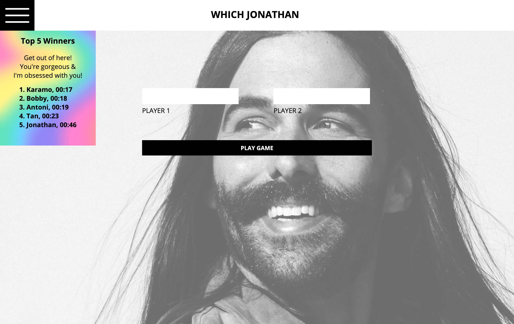
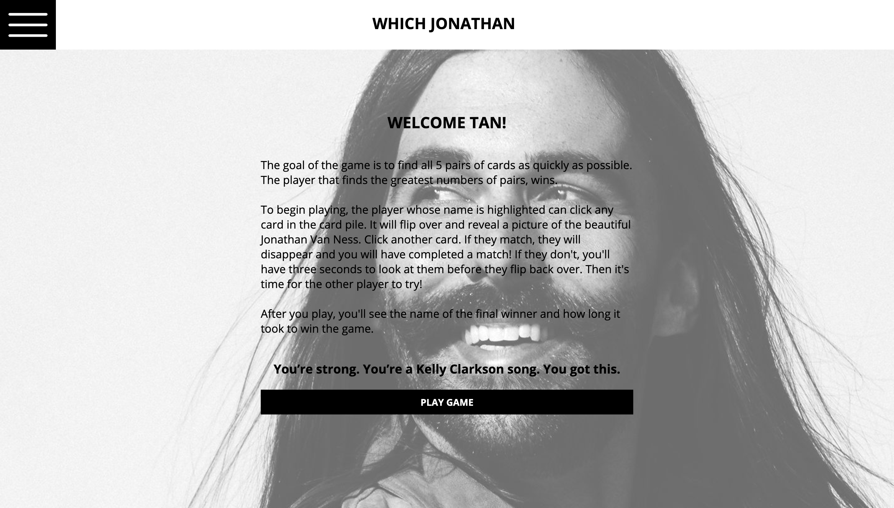
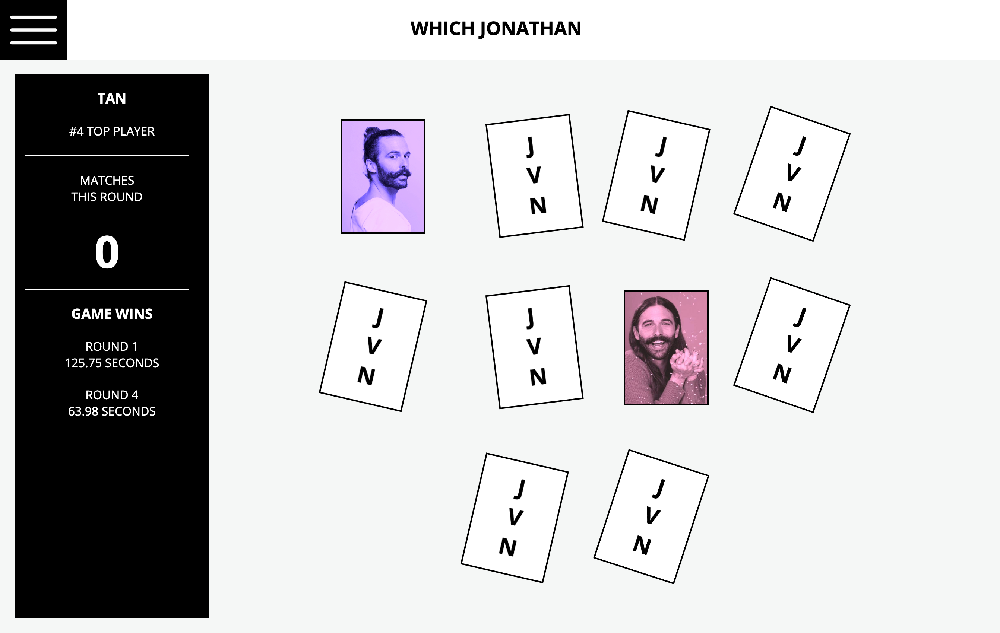
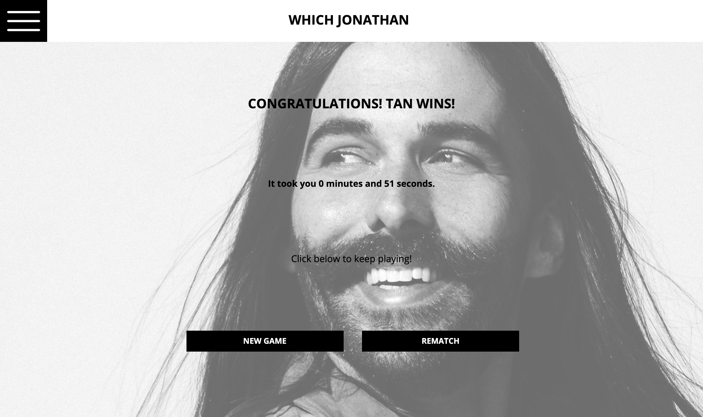
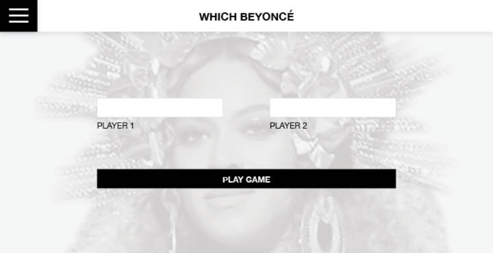
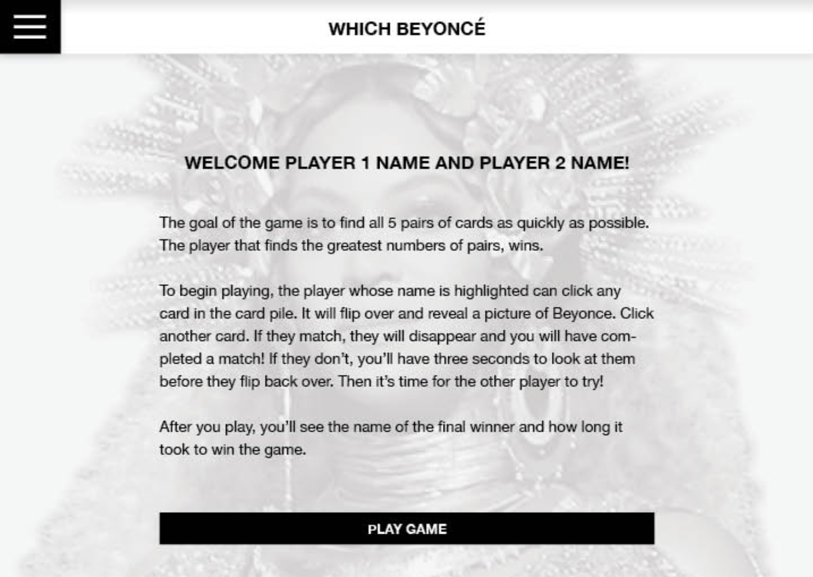
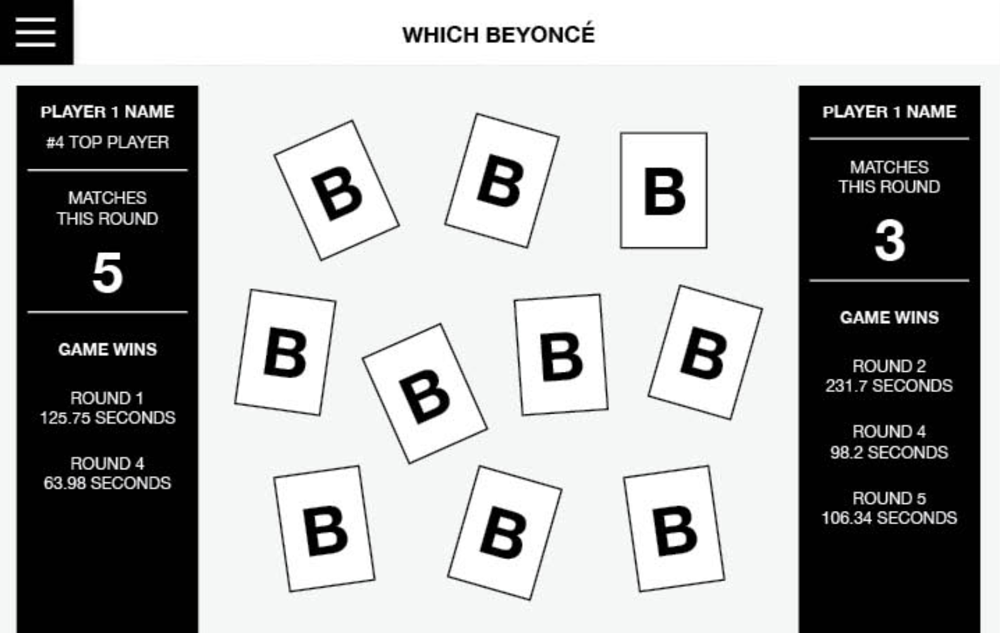
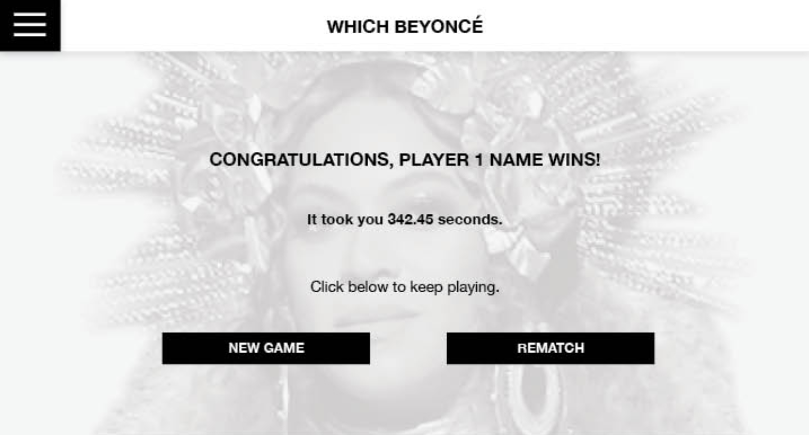

# Which Beyoncé

For this project, we were asked to create a concentration game consisting of 10 cards and up to 2 players.
Each player takes turns flipping over two cards at a time. If they match, that player “scores”. If the two cards don’t match, they must be flipped back over. The goal is the get the greatest amount of matches.

The comp example was Beyoncé but I chose to use Jonathan Van Ness for my project. I used a combination of HTML, CSS, and JavaScript to complete this project.

# Iteration 0 - Single Player Layout & UI

- User should see an input for their name, and a “Play Game” button
- User should enter their name, (note the two bullet points below) click “Play Game”, then see a greeting including their name and directions for how to play the game.
- If the user attempts to click the “Play Game” button before entering their name, they should receive a small but clear message as to why they can’t yet click the button, prompting them to change what they are providing.
- The limit on the name input field should be 32 characters.
- Once the user clicks “Play Game” on the directions screen, they should see ten cards, face down.
- User should be able to click on any card. Once each card is clicked on, the other side of it should be displayed. For now, don’t worry about “scrambling” cards up.

# Iteration 1 - Single Player Matches

- On the left hand side of the page, the player should see their name and the number of “Matches This Round”
- User should only be able to flip over two cards at a time.
- If the two flipped cards match, they should disappear and the “Matches This Round” count should increase.
- If the cards don’t match, the user can re-click them to turn them back over.
- User continues to click until they find all matches
- Once all matches are found, the user should see a congratulatory message including their name.

# Iteration 2 - A little more interesting, and a better UI

- Once all matches are found, the user should see a congratulatory message including their name and the amount of time it took, in minutes and seconds, for them to find all 5 matches. (The comp shows seconds, but we think minutes and seconds are more friendly to the user!)
- Each time a user plays, the ten cards should be assorted differently. The Deck class should handle this logic.
- Instead of having to manually re-click a card to turn it back face-down, the program should automatically flip both cards over, after the user has had ___ seconds from the time both cards are revealed to view them. This is a great opportunity to do some user testing and see what the right amount of time is!
- Anytime a card flips over, there should be a smooth transition.

# Iteration 3 - Implement Storage

- The users name should persist in Local Storage
- A “Top 5 Winner Board” should be available for the user to view when clicking the icon in top right corner. It should include the names of the 5 winners who won the game in the shortest amount of time, as well as the time they required to win. When the icon is clicked again, the board should no longer be visible.

# Iteration 4 - Two Player

- Two users should be able to compete.
- Both users should enter their name and see them displayed on the screen
- A clear visual should be provided at all times so users know whose turn it is, and how many matches each player has
- When the game is over, the winner’s name and (total) time took playing appears on the page. The visual indicator of whose turn it is no longer indicates it is either players turn.
- When the game is over, the users can click “Play Again” to start the game over from scratch.
- The winner board should provide the same data - top 5 winner names and time took.

# Comp:

